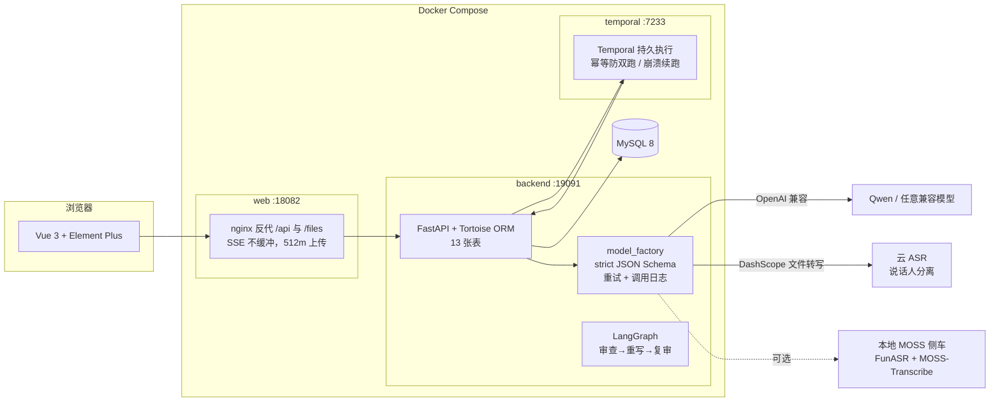

# MeetingBot

[](https://www.python.org/)
[](https://fastapi.tiangolo.com/)
[](https://vuejs.org/)
[](https://www.mysql.com/)
[](https://github.com/langchain-ai/langgraph)
[](https://temporal.io/)
[](#%E6%80%8E%E4%B9%88%E9%AA%8C%E8%AF%81%E5%AE%83%E7%9C%9F%E7%9A%84%E8%83%BD%E8%B7%91)
[](compose.yaml)

**一场会开完，纪要已经能用了。**

录音或视频传进来，MeetingBot 负责剩下的：转写（谁说了什么）→ 六字段结构化纪要 → Agent 对着原文自检一遍 → 人工确认归档。FastAPI + Vue 3 + MySQL + LangGraph + Temporal，Docker Compose 一条命令起全套。

但这个项目真正的主线是另一件事：**用可复算的评测回答「纪要质量怎么衡量」**。转写对齐 M2MeT 官方 cpCER 口径、忠实度对齐 Vectara HHEM、完整性用 FineSurE 式清单法、行动项核对 AID——每一条结论连口径、证据路径一起登记在 [`evaluation/LEDGER.md`](evaluation/LEDGER.md)，检不出就写检不出。


## 一场会议在这里经历什么

**① 上传与转写**：会议资料页上传音视频（SHA-256 去重），FFmpeg 抽单声道音轨，云端 ASR 单请求直传（≤2h 预检），说话人分离后逐段落库；片段支持人工修订，LLM 说话人匹配建议只从参会人名单里选。


**② 六字段纪要**：单遍长上下文调用生成六字段结构化纪要——概要、议题、观点、决策、待办、风险。每个字段带类型化槽位与证据来源（[`services/contracts.py`](ai_meeting/fastapi-app/services/contracts.py) 把「不许凭空断言」做成数据结构不变量）；磁盘调用缓存让重试不为成功过的调用重复付费。


**③ 证据门控自检**：LangGraph 状态机跑「审查 → 重写 → 复审」反思环——Agent 对着转写原文核对六块内容，发现问题自己改一版，全程 SSE 流式推给前端；修订稿**必须人工确认**才会覆盖原纪要。


**④ 确认与归档**：确认后的纪要一键导出 Word / PDF；运行观测页汇总每次模型调用的成功率、Token 用量与失败原因（统计卡片下图按天趋势，数据来自真实评测运行）。


## 质量是账本，不是感觉

评测体系占这个仓库的一半，宪法六条：结论预注册、裁判异族、检不出就写检不出、留出集消费记账、评测不 import 产品实现、不报加权总分（[`evaluation/README.md`](evaluation/README.md)）。核心结论摘录（口径与证据文件见账本）：

| 指标轴 | 关键数字 | 说明 |
|---|---|---|
| 转写（cpCER，M2MeT 口径） | **83.2% → 30.1%** | 说话人归属性字错误率；切分放宽到 3600s 后 8 场受控对比过预注册门禁（Δcp 8/8 ≤10pp、CER 差 +0.13pp），据此翻转产品默认值 |
| 可靠性 | 端到端 **96.3%** / 调用级 99.6% | 分母含全部失败尝试；调度账本一行 = 一次真实调用 |
| 忠实度（HHEM 同单位） | 初稿问题率 **23.1% → 重写后 0–7.7%** | 裁判与被测模型异族，裁判自复测一致率 97.4% |
| 完整性（清单法 v3） | 核心点覆盖 0.781（deepseek）/ 0.869（qwen） | 双族裁判逐点一致率 89.0%；单裁判绝对数只作方向信号 |
| 单元测试 | 产品 **187** 项 + 评测 **205** 项 | 零模型调用，CI 可复算 |

也有如实登记的负结果：LLM 裁判跨族标签翻转率 26–34%（所以绝对数必须连裁判族一起报）；plan+gap-fill 机制对覆盖的增益 +1.92pp 未过 +3pp 预注册阈值，保持默认关闭。

## 架构



转写 / 纪要 / 自检三类长任务全部走 Temporal 持久执行：workflow id 幂等防双跑、崩溃自动续跑、并发上限 2；每次模型调用写一行 `ai_call_log`（计时、Token、失败分类），观测页与可靠性统计都从这张表复算。无 Redis、无向量库、无 RAG——链路里每一环都能在代码里指到。

## 技术栈

| 层 | 选型 |
|---|---|
| 后端 | Python 3.12 · FastAPI · Tortoise ORM · Pydantic v2 · LangChain / LangGraph · Temporal |
| 前端 | Vue 3 · Vite 5 · Element Plus · ECharts · wangEditor |
| 数据 | MySQL 8（13 张表，建库脚本含种子数据） |
| 模型 | OpenAI 兼容接口（默认 Qwen3.8-Max + Qwen-Audio ASR，DashScope）；ASR 引擎可切换（云端 / 本地 MOSS 侧车） |
| 部署 | Docker Compose 五服务（db / backend / web / temporal / temporal-worker）· FFmpeg · nginx |

```
ai_meeting/
├── fastapi-app/               # 后端：api/ 路由 · services/ 领域服务 · common/ 基础设施
│   ├── services/contracts.py        # 纪要证据契约层（类型化槽位 + 来源闭合）
│   ├── services/agent_graph.py      # LangGraph 审查→重写→复审状态机
│   ├── services/model_factory.py    # 统一模型调用（结构化输出 / 重试 / 计费日志）
│   ├── services/temporal_workflows.py # 三类长任务持久执行
│   └── tests/                       # 产品侧 187 项零调用测试
├── vue/                       # 前端：14 个管理页面（会议 / 转写 / 纪要 / 自检 / 观测 / 配置）
└── ../ai_meeting.sql          # 建库脚本 + 种子数据（空卷初始化时导入）
evaluation/                    # 评测主线（与产品代码物理隔离，不 import 产品实现）
├── README.md                  # 评测宪法（六条硬规则）
├── DESIGN.md                  # 四层设计书（smoke / deep / gate / gold）
├── LEDGER.md                  # 可引用结论账本（口径 + 证据路径 + 撤回记录）
├── asr/ benchmarks/ judges/ gate/ gold/ regression/ lib/ tests/ results/
scripts/                       # compose.sh · moss_asr_server.py（本地 ASR 侧车）· indexes.sql
docs/assets/screenshots/       # README 实拍截图（真实启动后浏览器截图）
```

## 快速开始

```bash
cp ai_meeting/fastapi-app/.env.example ai_meeting/fastapi-app/.env
# 编辑 .env，至少填：
#   MYSQL_PASSWORD / MYSQL_ROOT_PASSWORD   数据库口令
#   JWT_SECRET                             openssl rand -hex 32
#   DASHSCOPE_API_KEY                      模型密钥（不填服务也能起，调用会失败但页面可逛）
#   APP_ADMIN_PASSWORD                     管理员初始密码

./scripts/compose.sh up -d --build   # 五服务全起：http://127.0.0.1:18082
```

`compose.sh` 统一从 `ai_meeting/fastapi-app/.env` 读配置（密钥不进根目录、不进镜像、不进版本控制）。种子数据带示例会议、转写、纪要与模型配置，管理员账号见 `.env` 的 `APP_ADMIN_USERNAME / APP_ADMIN_PASSWORD`（首次启动自动建号）。端口：web `18082` · backend `19091`（`/health`）· temporal UI `17233`，全部只绑 127.0.0.1。

### 怎么验证它真的能跑

```bash
make -C evaluation smoke    # L0 零调用回归：契约不变量 / 可定位率 / 可靠性复算（不需任何模型凭据）
make -C evaluation test     # 评测侧 205 项单测
cd ai_meeting/fastapi-app && .venv/bin/python -m pytest tests/ -q   # 产品侧 187 项
```

本地跑产品侧测试的依赖安装：`cd ai_meeting/fastapi-app && uv venv --python 3.12 .venv && uv pip install --python .venv/bin/python -r requirements.txt`（pip 等价亦可）。

### 跑评测（可选，需要模型凭据与预算）

评测分四层入口：`smoke`（零调用回归）/ `deep`（裁判判读）/ `gate`（留出集门禁）/ `gold`（金标注与裁判校准）。公开评测集（AliMeeting / VCSum）的语料与音频**不入库**——用 `evaluation/benchmarks/download_alimeeting.py` 按 manifest 清单复得；预算护栏（`manage_fixture.py`）直接拦截超预算的模型调用，live 运行必须显式开启。

## 运维与排查入口

| 想做什么 | 入口 |
|---|---|
| 起停 / 看日志 | `./scripts/compose.sh up -d / stop / logs --tail=100 backend` |
| 后端健康 | `curl http://127.0.0.1:19091/health`（查 DB 连通） |
| 换模型 / 换密钥 | 改 `.env` 后 `./scripts/compose.sh up -d --force-recreate backend` |
| 失败调用排查 | 前端「运行观测」页，或直接查 `ai_call_log` 表 |
| 卡死的任务 | 纪要页「强制结束」出口（forceFail） |
| 部署细节与红线 | [DEPLOYMENT.md](DEPLOYMENT.md)（单 worker 约束、密钥泄露处置、索引修复） |

## 更多页面

| 页面 | 截图 |
|---|---|
| 首页仪表盘 | [meetingbot-home.png](docs/assets/screenshots/meetingbot-home.png) |
| 会议管理 | [meetingbot-meeting.png](docs/assets/screenshots/meetingbot-meeting.png) |
| 会议资料 | [meetingbot-material.png](docs/assets/screenshots/meetingbot-material.png) |
| 转写任务 / 片段 | [列表](docs/assets/screenshots/meetingbot-transcription.png) · [片段详情](docs/assets/screenshots/meetingbot-transcription-detail.png) |
| 会议纪要 / 详情 | [列表](docs/assets/screenshots/meetingbot-minutes.png) · [六字段详情](docs/assets/screenshots/meetingbot-minutes-detail.png) |
| 纪要自检 / 运行详情 | [列表](docs/assets/screenshots/meetingbot-agent.png) · [运行详情](docs/assets/screenshots/meetingbot-agent-detail.png) |
| AI 模型配置 | [meetingbot-aimodel.png](docs/assets/screenshots/meetingbot-aimodel.png) |

以上均为本仓库代码真实启动（compose 五服务）后浏览器实拍。

## 这个仓库里没有的东西

- **没有语料与音频**：AliMeeting / VCSum 评测语料与会议音频不入库（体积与数据集许可），脚本可按清单复得；评测的 JSON / TXT 证据、运行账本与结论全部在库。
- **没有云依赖**：无 Redis、无向量库、无 RAG；模型走 OpenAI 兼容接口，换供应商只改 `.env`。
- **没有「跑通即完成」**：所有产品机制默认值都过预注册门禁才翻转，效应检不出就如实登记，撤回的结论连理由保留。
- **没有个人资料与生成式架构图目录**：仓库只含项目代码、评测资产与实拍截图。

## 文档导航

| 想了解 | 读这个 |
|---|---|
| 面向技术评审的项目报告 | [PROJECT_REPORT.md](PROJECT_REPORT.md) |
| 评测怎么设计、怎么跑 | [evaluation/README.md](evaluation/README.md) · [evaluation/DESIGN.md](evaluation/DESIGN.md) |
| 哪些结论可引用、证据在哪 | [evaluation/LEDGER.md](evaluation/LEDGER.md) |
| 部署细节 | [DEPLOYMENT.md](DEPLOYMENT.md) |
| 纪要契约与判定标准 | [ai_meeting/fastapi-app/CONTRACT.md](ai_meeting/fastapi-app/CONTRACT.md) · [JUDGMENT_STANDARD.md](ai_meeting/fastapi-app/JUDGMENT_STANDARD.md) |
