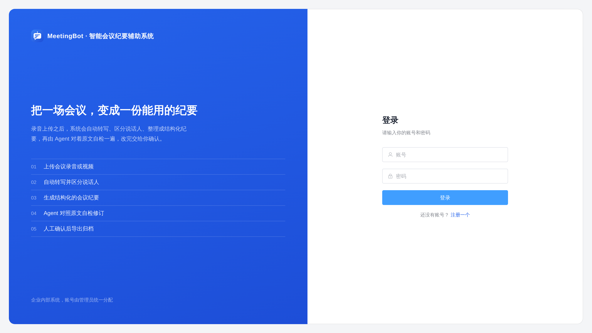
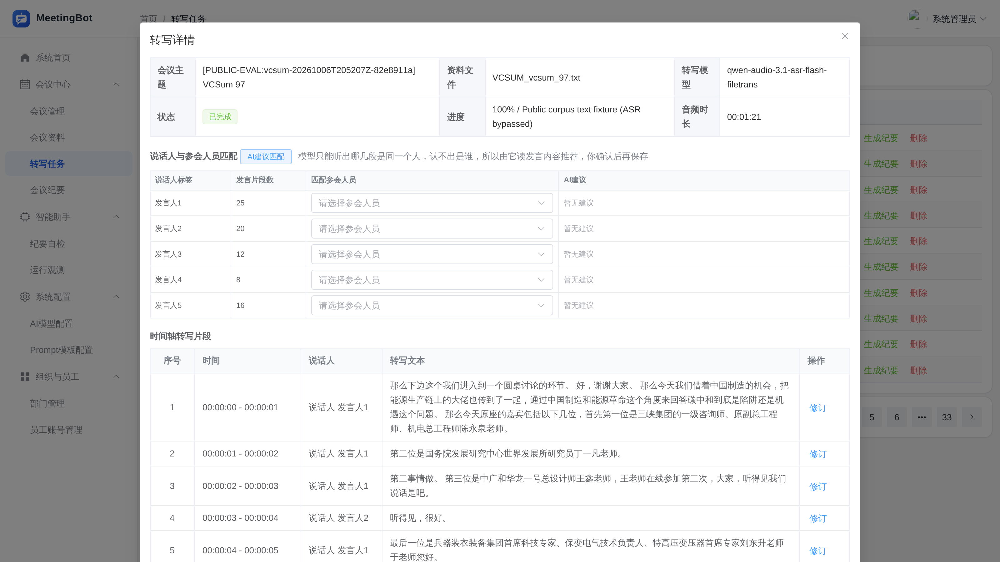
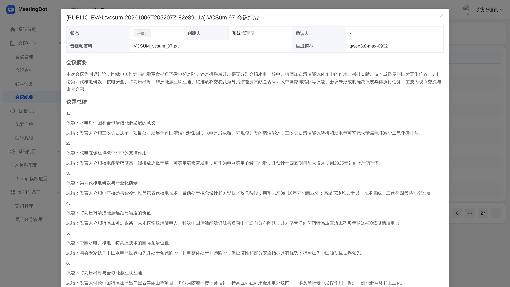
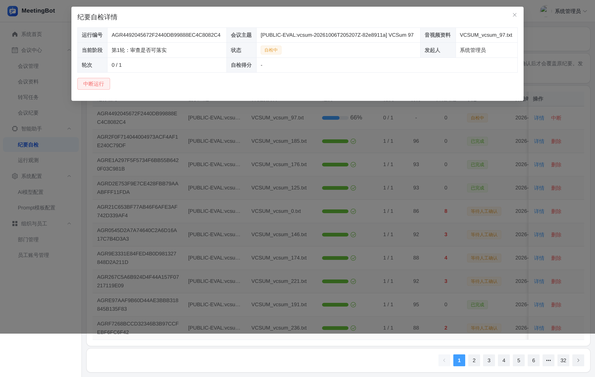
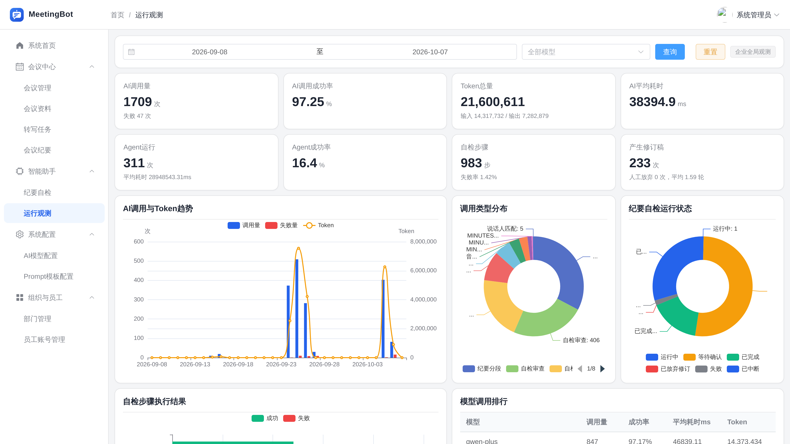
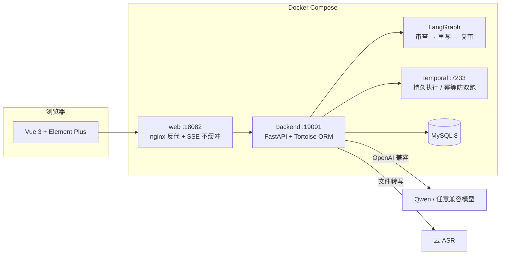

# MeetingBot

**一场会开完，纪要已经能用了。**

录音或视频传进来，MeetingBot 负责剩下的：转写（谁说了什么）→ 六字段结构化纪要 → Agent 对着原文自检一遍 → 人工确认归档。FastAPI + Vue 3 + MySQL + LangGraph + Temporal，Docker Compose 一条命令起全套。

[](https://www.python.org/)
[](https://fastapi.tiangolo.com/)
[](https://vuejs.org/)
[](https://element-plus.org/)
[](https://www.mysql.com/)
[](https://github.com/langchain-ai/langgraph)
[](https://temporal.io/)
[](compose.yaml)
[](LICENSE)



## 一场会议在这里经历什么

**① 上传**：会议资料页上传音视频，按内容哈希去重，同一份文件不会存两遍。

**② 转写**：FFmpeg 抽单声道音轨后走云 ASR 单请求直传（说话人分离），逐段落到数据库；片段支持人工修订，说话人拿不准时可以一键让 LLM 从参会人名单里给建议。



**③ 纪要**：单遍长上下文调用生成六字段结构化纪要——概要、议题、观点、决策、待办、风险；每个字段带类型化槽位与证据来源，契约层把「不许凭空断言」做成数据结构不变量。



**④ 自检**：LangGraph 状态机跑「审查 → 重写 → 复审」反思环，Agent 对着转写原文核对六块内容，全程 SSE 流式推给前端；修订稿必须人工确认才会覆盖原纪要。



**⑤ 确认归档**：确认后的纪要一键导出 Word / PDF；运行观测页把每次模型调用记账——成功率、Token 用量、失败原因，卡的住的证据都在。



## 转写：谁在什么时候说了什么

- 云端 ASR 单请求直传整段录音，一次调用拿到带说话人标签的分段结果，不再切块拼接
- 时长预检（≤2h）先拦一道，超长录音在入队前拒绝，不浪费调用
- 引擎可切换：默认云端（DashScope 文件转写），也可以指向本地侧车（FunASR + MOSS-Transcribe-Diarize）
- 片段级人工修订：改错字、合并拆分、重指说话人都落在 `transcript_segment` 表，可回溯
- 说话人建议是 suggestion-only：LLM 只从参会人名单里选，采纳与否由人决定

## 纪要：六个字段，每个都有出处

- 概要 / 议题 / 观点 / 决策 / 待办 / 风险，Pydantic 模型由契约层派生，结构化输出走 strict JSON Schema
- 每个槽位带类型（是否明说、是否推导、是否未提及）与来源闭合（origin + 证据 span），展现层做版本适配
- 磁盘调用缓存按「模型 + 提示词」哈希去重，重试不会为已经成功过的调用重复付费
- 修订、确认 / 取消确认、强制结束三条状态出口都在页面上，状态流转全部留痕

## 自检：改完必须人工确认

- 审查、重写、复审三个动作由 LangGraph 编排，图本身不碰数据库和模型，动作注入，可独立测试
- 每一步的输入输出、判定依据存 `agent_step`，运行状态机覆盖中断与恢复
- SSE 把步骤实时推到前端，长任务不用轮询
- 修订稿与原稿并存，人工确认前不覆盖；确认后原稿进入历史

## 观测：每次调用都记账

- 每次模型调用写一行 `ai_call_log`：调用类型、耗时、Token、失败原因——「一行 = 一次真实调用」
- 失败分类器把超时 / 连接 / 限流 / 服务端错误分开，重试策略只对瞬态错误生效
- 观测页按天汇总趋势、成功率与模型排行，员工视角按业务归属过滤

## 架构



| 链路 | 走过谁 |
|---|---|
| 转写链路 | 上传 → Temporal 提交任务 → ASR → 分段落库 →（可选）说话人建议 |
| 纪要链路 | 转写就绪 → 单遍长上下文生成 → 契约校验 →（可选）自检反思环 → 人工确认 → 导出 |

转写 / 纪要 / 自检三类长任务全部走 Temporal 持久执行：workflow id 幂等防双跑、崩溃自动续跑、并发上限 2。无 Redis、无向量库、无 RAG——链路里每一环都能在代码里指到。

## 技术栈

- **后端**：Python 3.12 · FastAPI · Tortoise ORM · Pydantic v2 · LangChain / LangGraph
- **调度**：Temporal（durable execution，三类长任务）
- **前端**：Vue 3 · Vite 5 · Element Plus · ECharts · wangEditor
- **数据**：MySQL 8（13 张表，建库脚本含种子数据）
- **模型**：OpenAI 兼容接口（默认 Qwen3.8-Max + Qwen-Audio ASR），ASR 引擎可切换云端 / 本地侧车
- **部署**：Docker Compose 五服务 · FFmpeg · nginx
- **安全**：bcrypt 哈希 · JWT 密码指纹（改密即吊销）· 登录限流 · 服务端 MIME + nosniff · 统一权限口径

```
ai_meeting/
├── fastapi-app/                     # 后端
│   ├── api/                         # 路由：会议 / 资料 / 转写 / 纪要 / 自检 / 观测 / 配置
│   ├── services/                    # 领域服务：契约层 / 模型工厂 / 反思环 / Temporal 工作流
│   ├── common/                      # 基础设施：认证 / 限流 / JSON 修复 / 供应商能力表
│   └── tests/                       # 产品侧零调用测试
├── vue/                             # 前端：14 个管理页面
└── ../ai_meeting.sql                # 建库脚本 + 种子数据（空卷初始化时导入）
evaluation/                          # 评测体系（与产品代码物理隔离，不 import 产品实现）
├── README.md / DESIGN.md            # 评测宪法与四层设计书
├── LEDGER.md                        # 结论账本：可引用结论 + 撤回记录
├── asr/ benchmarks/ judges/ gate/ gold/ regression/ lib/ tests/
scripts/                             # compose.sh · 本地 ASR 侧车 · 索引脚本
docs/assets/                         # logo 与 README 实拍截图
```

## 快速开始

```bash
cp ai_meeting/fastapi-app/.env.example ai_meeting/fastapi-app/.env
# 编辑 .env，至少填：
#   MYSQL_PASSWORD / MYSQL_ROOT_PASSWORD   数据库口令
#   JWT_SECRET                             openssl rand -hex 32
#   DASHSCOPE_API_KEY                      模型密钥（不填服务也能起，调用会失败但页面可逛）
#   APP_ADMIN_PASSWORD                     管理员初始密码

./scripts/compose.sh up -d --build       # 五服务全起
```

配置统一从 `ai_meeting/fastapi-app/.env` 读取（密钥不进根目录、不进镜像、不进版本控制）。种子数据带示例会议、转写、纪要与模型配置；管理员账号见 `.env` 的 `APP_ADMIN_USERNAME / APP_ADMIN_PASSWORD`（首次启动自动建号）。

| 入口 | 地址 |
|---|---|
| 网页 | <http://127.0.0.1:18082> |
| 后端健康检查 | <http://127.0.0.1:19091/health> |
| Temporal | 127.0.0.1:17233（仅本机回环） |

## 怎么验证它真的能跑

```bash
make -C evaluation smoke    # 零调用回归：契约不变量 / 可定位率 / 可靠性复算（不需任何模型凭据）
make -C evaluation test     # 评测侧单测
cd ai_meeting/fastapi-app && .venv/bin/python -m pytest tests/ -q   # 产品侧单测（内存 SQLite + Mock 模型）
```

产品侧本地环境：`cd ai_meeting/fastapi-app && uv venv --python 3.12 .venv && uv pip install --python .venv/bin/python -r requirements.txt`（pip 等价亦可）。

评测体系分四层入口：`smoke`（零调用回归）/ `deep`（裁判判读）/ `gate`（留出集门禁）/ `gold`（金标注与裁判校准）。公开评测集（AliMeeting / VCSum）的语料与音频不入库，用 `evaluation/benchmarks/download_alimeeting.py` 按清单复得；live 运行有预算护栏并必须显式开启。

## 运维与排查入口

| 想做什么 | 入口 |
|---|---|
| 起停 / 看日志 | `./scripts/compose.sh up -d / stop / logs --tail=100 backend` |
| 后端健康 | `curl http://127.0.0.1:19091/health`（查 DB 连通） |
| 换模型 / 换密钥 | 改 `.env` 后 `./scripts/compose.sh up -d --force-recreate backend` |
| 失败调用排查 | 前端「运行观测」页，或直接查 `ai_call_log` 表 |
| 卡死的任务 | 纪要页「强制结束」出口（forceFail） |
| 部署细节与红线 | [DEPLOYMENT.md](DEPLOYMENT.md)（单 worker 约束、密钥泄露处置、索引修复） |

## 决策记录

产品机制的默认值不是拍脑袋定的：每个候选机制先写预注册规则再跑数，过了门禁才翻转默认；不显著的结论如实登记「检不出」，撤回的结论连理由保留。这些记录连同证据路径都在评测账本里，按章节节选：

| 主题 | 记录在哪 |
|---|---|
| 转写切分参数的产品默认值 | [evaluation/LEDGER.md](evaluation/LEDGER.md) · 预注册：切分提默认的判定规则 |
| 单请求直传 vs 切块拼接 | `LEDGER.md` · R5 ASR 单请求复测（假设修正过程） |
| 自检反思环的保默认机制 | `LEDGER.md` · R3 保默认机制验证 |
| 优化机制的默认开关状态 | `LEDGER.md` · 产品机制状态表 |
| 全部撤回与存疑结论 | `LEDGER.md` · 存疑与已撤回 |

## 这个仓库里没有的东西

- **没有语料与音频**：AliMeeting / VCSum 评测语料与会议音频不入库（体积与数据集许可），脚本按清单复得；评测证据与运行账本在库。
- **没有云依赖**：无 Redis、无向量库、无 RAG；模型走 OpenAI 兼容接口，换供应商只改 `.env`。
- **没有密钥**：`.env` 与任何密钥都不在版本控制内，仓库只有 `.env.example`。
- **没有个人资料与生成式架构图目录**：仓库只含项目代码、评测资产与实拍截图。

## 许可

- 本项目使用 [MIT 许可证](LICENSE)，可自由使用、修改与商用，保留版权声明即可。
- 使用云模型服务（Qwen / ASR）时请遵守对应供应商的服务条款；评测数据集的使用请遵守数据集自身的许可。
